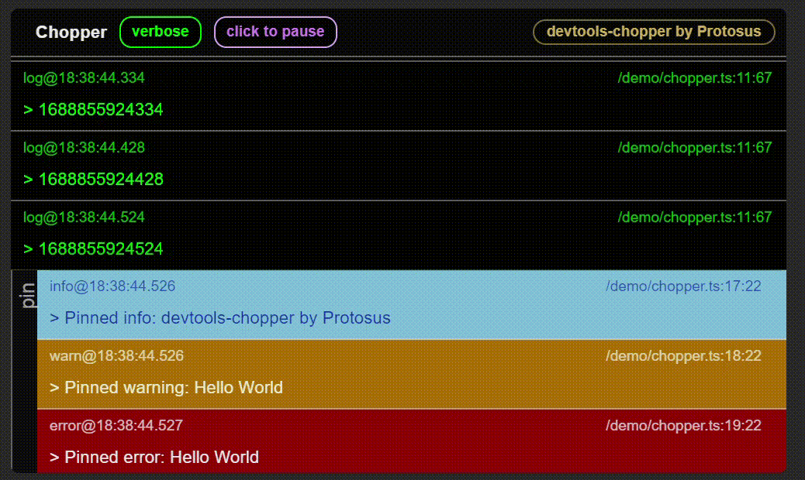
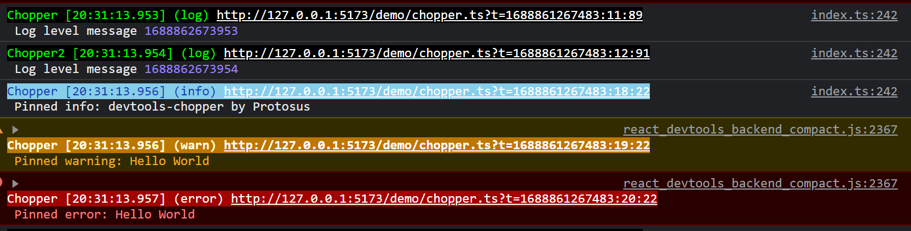

by `Protosus`

# devtools-chopper

[](https://github.com/savanesoff/devtools-chopper)
[](https://github.com/savanesoff/devtools-chopper/actions/workflows/test.yaml)
[](https://badge.fury.io/js/devtools-chopper)
[](https://opensource.org/licenses/MIT)
[](https://github.com/savanesoff/devtools-chopper)

Chopper is a Javascript log display devtool which allows you to monitor application logs in DOM.
Its highly customizable and extends [`overdrag`](https://www.npmjs.com/package/devtools-chopper) package.

> 🌲🌲🌲 "chopping" logs 🌲🌲🌲

## Demo

You can view a live demo [here](https://savanesoff.github.io/devtools-chopper)

[](https://savanesoff.github.io/devtools-chopper)

## Installation

To install `devtools-chopper`, use npm or yarn:

```shell
npm install devtools-chopper
```

or

```shell
yarn add devtools-chopper
```

[](https://nodei.co/npm/devtools-chopper/)

## Usage

```TS
import Chopper from "devtools-chopper";
const chopper = new Chopper();

// infinite scroll
chopper.$log('Message');
// pinned
chopper.$pin.log('Message');
```

## Constructor

The Overdrag class constructor accepts an object with the following properties:

- **`name`** (required): name of logging

Optional:

- **`level`** (default: 'verbose'): Controls both chopper's and console outputs made by chopper.

- **`styles`** (default: current chopper console only theme): CSS styles object. Use plain CSS to style DOM elements.

- **`console`** (default: 'true'): Print to console.

The following are inherited`overdrag` parameters:

- **`element`** (default: random positioned `div` in body): The DOM element to control.

- **`minContentHeight`** (default: `Overdrag.DEFAULTS.minContentHeight`): The minimum height of the DOM element (CSS height) in pixels. This prevents resizing smaller than the specified value.

- **`minContentWidth`** (default: `Overdrag.DEFAULTS.minContentWidth`): The minimum width of the DOM element (CSS width) in pixels. This prevents resizing smaller than the specified value.

- **`maxContentHeight`** (default: `Overdrag.DEFAULTS.maxContentHeight: Infinity`): The max height of the DOM element (CSS height) in pixels. This prevents resizing bigger than the specified value.

- **`maxContentWidth`** (default: `Overdrag.DEFAULTS.maxContentWidth: Infinity`): The max width of the DOM element (CSS width) in pixels. This prevents resizing bigger than the specified value.

- **`snapThreshold`** (default: `Overdrag.DEFAULTS.snapThreshold`): The distance to the edge of the relative parent element (top, left, bottom, right) when the element should snap to it.

- **`controlsThreshold`** (default: `Overdrag.DEFAULTS.controlsThreshold`): The distance to the edge of the element (top, left, bottom, right) when the element should show resize cursor and activate control points.

- **`clickDetectionThreshold`** (default: `Overdrag.DEFAULTS.clickDetectionThreshold`): The threshold distance to detect a click event. If you've started dragging the element, mouse up event will not trigger `click` event.

- **`stack`** (default: `false`): If true, an `Overdrag` parent element that has a recursively embedded `Overdrag` elements as a child will retain `over` state while the child is active. Else, the parent element will be set to `out` state (inactive)

## Extend Class

```TS
import Chopper from "devtools-chopper";

class MyClass extends Chopper {
    constructor(){
        super({name: 'MyClass'});
        this.$log(this.name + 'initialized');
    }
}
```

## Description

You can control many different aspects of the instance by referring to its [`overdrag` extension documentation](https://www.npmjs.com/package/devtools-chopper)

### In Brief:

Chopper includes the following functionalities and interactions:

- Draggable: within offsetParent bounds
- Resizable: using control points
- Play, Pause of scrollable logs
- Level switch: changes level interactively
- Style every aspect of it using CSS

## Console

When printing to console, the theme will be applied as well!


## Future plans

- No future plans

### PS

[](https://github.com/savanesoff/devtools-chopper)

Enjoy! 🎉🎉🎉
